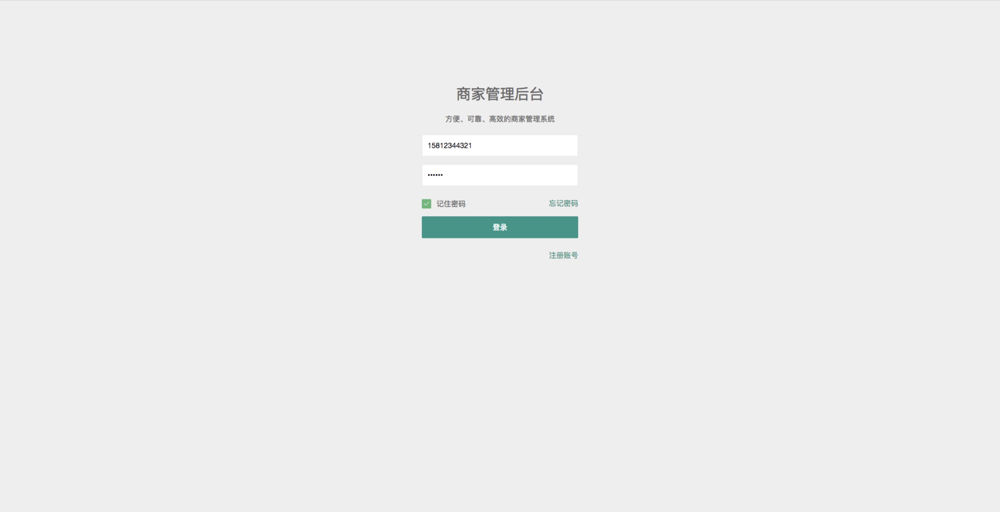
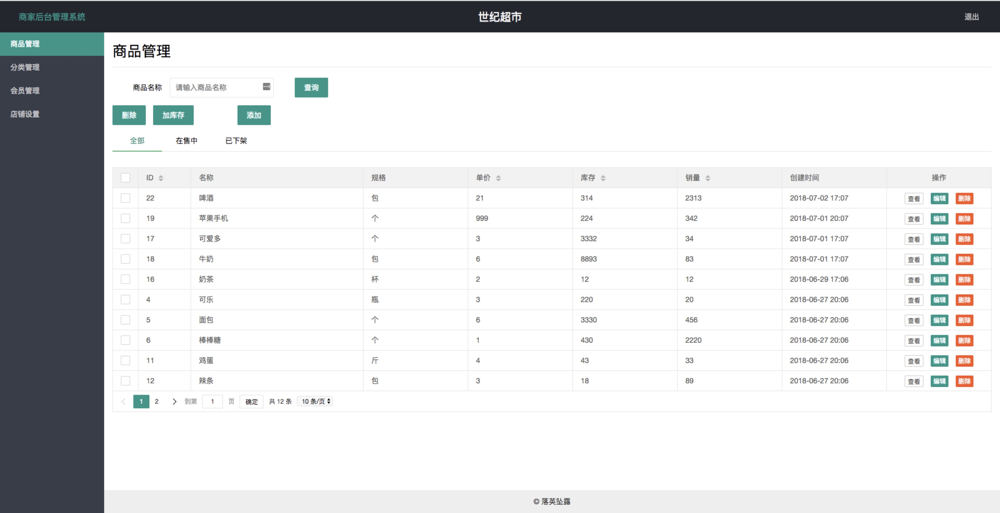
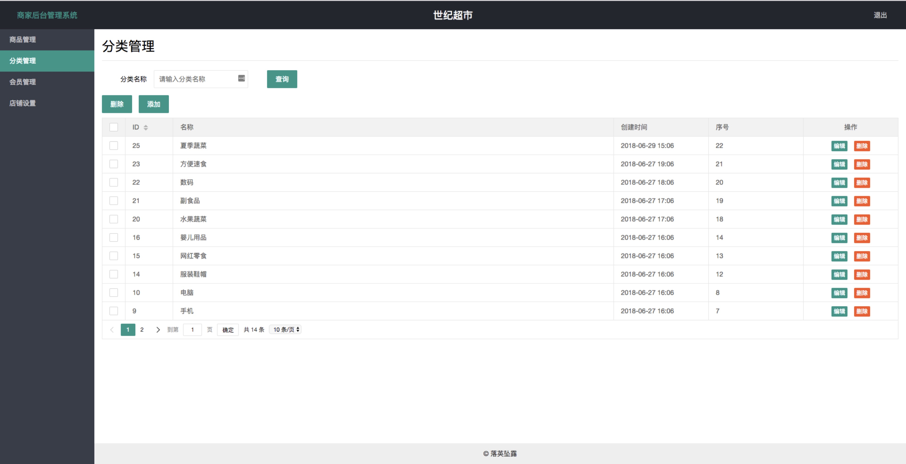
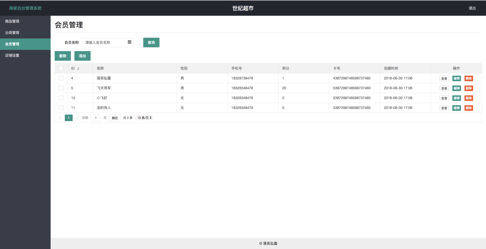
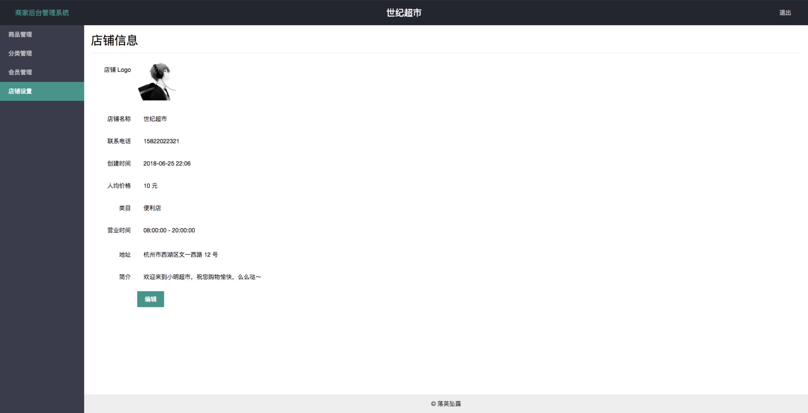

## 商家后台管理系统

商家后台管理系统，配合门店收银机和微信小程序使用，方便快捷地管理商品和订单，是开店的好帮手。

项目使用主流的 SSM 框架，为的是快速开发。数据库使用 MySQL，数据缓存采用 Redis，支持基本的增删改查。
前端框架使用 layui，它小巧却强大，适合开发后台界面。

体验地址：http://47.98.173.179/login.html

---

### 功能模块

1. 注册登录
2. 商品管理
3. 分类管理
4. 会员管理
5. 店铺设置

### 技术选型

**后端：**

- 基础框架：Spring Boot
- 持久层框架：Mybatis
- 模板引擎：Thymeleaf
- 数据库：MySQL
- 数据库连接池：Druid
- 缓存框架：Redis
- 反向代理：nginx
- 其他：Logback, spring-session 等

**前端：**

- 基础框架：layui
- JavaScript 框架：jQuery

### 开发环境

- 语言：Java 8
- IDE：IntelliJ IDEA
- 依赖管理：Maven
- 版本管理：Git

### 不足之处

1. 有几个功能点未实现
2. redis 缓存没有发挥全力
3. 有几个接口专门为前端展示修改

**注意：使用的时候，application 的配置要适当修改**

### 系统预览

